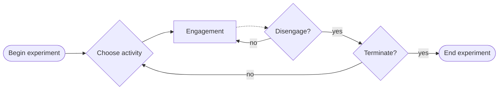

# What can we learn from free exploration lab experiments?

Here is a generic example of a Free Exploration Paradigm (FEP):

The process begins by letting the learner (or the agent) choose a learning activity. Upon deciding which activity to pursue the learner engages in it. During engagement, the experimenter can optionally intervene and distract the learner from the activity. For instance, Ten et al. (2021) forced the learner to choose the learning activity on each trial; however, this is not a crucial element of the paradigm. During the activity engagement, the agent can at some point decide to `disengage` from it. The absence of contemplation or a negative decision implies continued engagement in the current activity. A decision to disengage from current activity may reflect one's determination to `terminate` the experiment entirely, or engage in another activity in the experiment.

There are several points of ambiguity that we need to address. Perhaps the most obvious one concerns my vague usage of the concept of ***learning activity***: what exactly do I mean by this?

## Learning Activities

An uncontentious definition of a learning activity is any activity that results in learning. Trying to define learning in humans is a treacherous rabbit hole, so we will noncommittally adopt straightforward definition from Machine Learning (ML) and suppose that learning amounts to the *process of improving on a task with experience*[^1]. ==Thus, a learning activity is any activity that enables the agent to improve on a task with experience.==

We will also assume that the agents, including humans, behave according to a policies that can be conditioned on context and goals[^2]. Put simply, what the agent does in any given situation is determined by how the agent perceives the situation and what it strives to achieve. Activities are made up of multiple *interactions* between the agent and the environment. When these interactions lead to a successful task completion, the policy can get reinforced. When unsuccessful, these interactions can generate clues for policy adjustment. These clues come in the form of perceived consequences of the agent's actions relative to the agent's goals. A very common example of a policy-adjustment clue is prediction error.

### Goals and Tasks
At this point, it is useful to introduce conceptual distinctions between *goals* and *tasks* that will be relevant for the current discussion. I propose to use the term *goal* to refer to a *representation* that embodies a set of criteria that can be applied to any aspect of the agent's state space[^7]. Importantly, goal representations are *target states* that the agent works to approach (or avoid; see [Elliot & Ryder, 2008](https://books.google.de/books?hl=en&lr=&id=5f9OAgAAQBAJ&oi=fnd&pg=PA235&dq=The+goal+construct+in+psychology+2008&ots=zma9bJ3sLM&sig=bQnQGxCSFFEtCFuNIUH-DLu2a-c#v=onepage&q&f=false)). The term *task* is often conflated with *goal*, but it is subtly distinct. Consider Merriam-Webster entries for the words [Task](https://www.merriam-webster.com/dictionary/task) and [Goal](https://www.merriam-webster.com/dictionary/goal): 

|Word|Definition|Synonyms|
|--|--|--|
|Goal|The end toward which effort is directed|aim, ambition, dream, ideal|
|Task|(a) A usually assigned piece of work often to be finished within a certain time; (b) something hard or unpleasant that has to be done|assignment, job, duty, chore|

We have already assumed that learning is the process of improving on a task with experience. However, considering that humans can generate, select, and pursue their own *goals*, we may extend our definition of learning to include processes that confer improvement towards such self-determined goals, and not only externally assigned *tasks*[^3]. ==Thus, a learning activity is any activity in which the agent can improve in achieving a goal with experience.==

Without providing further details, our modified definition is problematic. Consider a goal of getting to one's workplace. The route is familiar, and Alice, the commuter, takes orderly steps to get closer to goal completion: she exits the house, goes to the bus stop, waits for the bus, gets on, rides past a few stops, gets off, and walks to the office. Obviously, traversing familiar route to a goal is not a learning activity -- it's an execution of an already learned goal-conditioned policy. So in what sense does improvement in goal-achievement make an activity a learning one?

First, let us think how we could tweak the previous example in order change a goal-directed activity (commuting to work) into a learning activity. We can imagine Alice not knowing how to get to her workplace from her house. In that case, she could go out of her house and *try out* different routes, or different buses, or other means of transportation, until eventually finding something that works. What seems to distinguish a learning activity from a non-learning goal-directed activity here, is the *lack of knowledge* for goal-achievement. With this observation in mind, let's see if we can update our definition again: ==a learning activity is any activity in which the agent can improve (with experience) in achieving a goal that it does not know how to achieve.== 

That's better, but we're not quite there yet. Suppose Alice does not know how to get from home to work, yet she happens to follow a route that will ultimately bring her to the desired location. This fits the definition above, but does this situation really represent a learning activity? In what sense is Alice improving in achieving the goal that she does not know how to achieve and in what sense does she not? Objectively speaking, she is indeed getting closer to goal-achievement, but is she getting better at getting to work? It is hard to say that she is learning how to get to her work, because until she can *evaluate* the successfulness of her attempt, she cannot adjust or reinforce her policy. Improvement in goal achievement due to learning should be distinguished from reducing the proximity to goal achievement due to exploiting existing knowledge. What is improved in learning activities is the ability, the skill, the knowledge for achieving a goal. Thus, finally, our definition of a learning activity is ==any activity in which affords the experience for the agent to improve its ability to achieve a goal (that it does not know how to achieve).== According to this definition, learning activities vary in what goals they are defined on and how much improvement they afford. Note that engaging in learning activities is not necessary for learning to take place. Sometimes agents learn through classical conditioning, sometimes through unexpected observations, etc.

Now that we've specified what learning activities are more precisely and explained how they afford learning experiences, we should spend more time contemplating what goals are. After all, learning activities are defined in terms of goals. One implication is that the choice of and engagement in a learning activity might depend the goal that the activity is aiming at.

### Goal Variability
Goal representations can vary considerably along several dimensions. One dimension that is relevant to the current discussion is ***goal abstraction***. Some goals are relatively concrete (e.g., `make a cup of fresh tea`), while other goals seem pretty abstract (e.g., `find meaning in life`). I am not sure what factors determine goal abstraction, but it appears that what abstract goals are to concrete goals is the same as what concrete goals are to actions. Put differently, there might be a hierarchy from low-level directives (e.g., motor-neuron signals) all the way up to abstract goals in the brain (see [Fine & Hayden, 2021](https://royalsocietypublishing.org/doi/10.1098/rstb.2020.0524)) with the so-called *intrinsic goals*, such as biological and psychological needs, residing on top of the hierarchy (see [Juechems & Sommerfield, 2019](https://www.cell.com/trends/cognitive-sciences/pdf/S1364-6613(19)30200-1.pdf)). An abstract goal, like a desired self-image (see [Markus & Wurf](https://www.annualreviews.org/doi/abs/10.1146/annurev.ps.38.020187.001503)) can constrain lower level goals and actions. For instance, someone who strives to be a conscientious and do-right person might play by experimental instructions better than someone who is in it for the money or credit.

Another dimension of goal variability that seems to be important is ***goal orientation***. Two widely studied goal orientation categories are *mastery* and *performance* ([Senko et al., 2009](http://www.tandfonline.com/doi/abs/10.1080/00461520.2011.538646)). However, goals can represent a wide range of aspects of the vast state space. Some goals represent states of the environment external to the agent's body. For instance, if one wants to make a cup of tea, the corresponding goal might represent a freshly brewed cup of tea sitting on a table (:tea:)[^4]. Goals can also represent states of the agent's own body. For example, if one feels cold, one might set a goal of being warm -- a representation of the state of warmness (🔆; note that this is a relatively more abstract goal, compared to :tea:). 

Intriguingly, goals can also represent and metacognitive states such as feelings of knowing, or feelings of efficacy. This enables humans to regulate not only their physiological states, but also their epistemic states. For a few concrete examples, think of a person who wants to `get good at chess`, or `be able to play guitar`, or `know how far the moon is from Earth`. Epistemic states are inextricably related to learning -- learning can be viewed as a progression from one epistemic state to another. Even when a higher-level goal is non-epistemic (e.g., `draw an owl`) one needs to set and pursue lower level epistemic goals (e.g., `learn to draw (an owl)`) if one is aware his or her current inadequacy. When we don't know how to do something that we want to be able to do, we usually try to learn it, rather than try to do it[^5].

Finally, different goals can be characterized by the degree to which an agent "identifies with" them. This dimension is addressed at length by [Ryan and Deci's (2000)](https://psycnet.apa.org/record/2000-13324-007) Organismic Integration Theory (OIT), but is also important is self-control literature ([Inzlicht et al., 2014](https://pubmed.ncbi.nlm.nih.gov/24439530/#:~:text=Dominating%20contemporary%20research%20on%20this,(i.e.%2C%20ego%20depletion))) where a distinction is made between "want-to" and "have-to" goals. We can call this dimension ***self-integration*** -- the more integrated a goal into one's self, i.e., the more one identifies with a goal, the more intrinsic is the motivation to work towards this goal. This brings back the notion of *motive* as a capacity to derive pleasure or satisfaction from a particular state [Atkinson (1957)](https://psycnet.apa.org/record/1959-03029-001). An individual can be considered to "identify" with a goal (state) if he or she has tends to enjoy being in this state, regardless of where this enjoyment derives from or whether this state is instrumental towards something else.

### Antigoals
The notion of a goal implies that it is something that is strived for -- a state that the agent works to approach. Sometimes, however, behaviors can be driven by what I'll call antigoals -- states that the organism works to escape or avoid. Hunger, pain, anxiety, uncertainty, and boredom are examples easy to understand.

Antigoals are relevant for the FEP because people might disengage from one activity and engage in another not because they decide to pursue a different goal, but because they try to avoid boredom. This would be an instance of *diversive* exploration, as opposed to *specific* exploration.

### Interim Summary
In summary, we have specified that activities are sequences of goal-directed agent-environment interactions. We then defined learning activities as follows: 
> ***Learning activities*** provide reinforcing experiences that can make agents get better at achieving specific goals. 

We noted that goals are state representations that agents work to approach or avoid. We also noted that goals can very in terms of level of abstraction, orientation, and self-integration. Next, we will consider why it is important to be aware of goal-variability in the FEP.

## Goal Pursuit in the FEP

As argued by [Atkinson (1957)](https://psycnet.apa.org/record/1959-03029-001), a theory of motivation should account for two central phenomena. First, it needs to explain ***task (or activity) selection***: why does the agent choose to engage in a particular activity at the expense of pursuing alternative activities? Second, it needs to explain ***task (or activity) investment***: on a given activity, what determines how much work the agent is willing to invest (e.g., how much effort they put it, how long they persevere in the face of failure, how much they are willing to sacrifice, etc.)? The FEP seems to be well suited to capture both of these behavioral phenomena. Moreover, the FEP was introduced to study ***intrinsic motivation***, i.e., task selection and task investment in a context where the performance on any of the available tasks has no effect on monetary rewards. 

> ***Activity selection*** refers to the process of deciding which goal to pursue.
> ***Activity investment*** refers to the amount of effort and persistence invested in a given task.

Note that preceding discussion on goal variability suggests that the FEP captures intrinsically motivated behavior only in a narrow sense: we assume that the motivation determining task selection and task investment is intrinsic only because there are no *traditional* performance-contingent rewards. My hunch is that having such rewards in a behavioral experiment is inherited from the foundational decades of behaviorism where the most obvious way to motivate (or demotivate) animals was to provide tangible stimuli like food or electric shocks. 

However, it is not unreasonable to say that whatever people do in any experiment is often, if not always, directed towards high-level aspirations --- e.g., a more conscientious subject would follow instructions better than a less conscientious one (I think [O'Reilly et al., 2014](s), make a similar point, but I need to read the whole paper, not just the abstract). Just like our biological needs, psychological needs can become more or less acute over time and there might always be some higher-level ideal we consciously or subconsciously strive for, so goal-directed behavior may not always be "intrinsically motivated". There are a couple of compatible ways to approach this conundrum. First, since these high-level aspirations are out of our reach, we can simply control for them by measuring relatively long-term behavioral tendencies, i.e., personality traits (e.g., Big Five; [Cobb-Clark & Schurer, 2012](https://www.sciencedirect.com/science/article/pii/S0165176511004666)[^6]). Second, we might want to shift out focus from the "intrinsicality" of motivation to goal self-identification. What we really want to know is why determines task selection and task investment when there is no ***classical reinforcers*** (money, credits, social approval, food, pain, fear) involved. 

If we can successfully remove or neutralize the motivational effects of classical reinforcers in the FEP, we can reasonably assume that whatever goals participants select to pursue or avoid must reflect their latent capacity to enjoy (or dislike) these states. And herein lies the power of the FEP. By tracking what activities people choose, for how long, and what interactions occur in these activities, we can assess the credibility of different ideas about latent factors of motivation.

### Hypotheses:  Certainty, Competence, & Progress

We can now discuss several hypotheses about motives outside the set of classical reinforcers. These hypotheses make predictions about what determines activity selection and investment. 

> The progress hypothesis (PH) states that humans enjoy activities that offer knowledge enhancement.

There are actually several versions of the PH. One version --- the *learning* progress hypothesis (LPH) --- states that enjoyment derives from improvement in predictions. For example, when an infant interacts with a new toy for the first time, they might squeeze it, bite on it, bash it against the floor, pull it apart, and so on. Each of these interactions produce a certain sensory feedback which improves the infant's ability to predict what happens when they act a certain way with the toy in their possession. Learning progress implies that either a goal or an antigoal is involved. On the one hand, the child might be trying to reduce uncertainty about what would happen if they acted on the toy a certain way --- essentially an antigoal of avoiding uncertainty. On the other hand, the child might be trying to test specific predictions about certain interactions. While these two perspectives seem identical, avoiding uncertainty can be resolved by simply distracting oneself from the uncertain toy, while if the child wants to know what happens if they bite on it, they can't just turn away. One thing that is seems clear is that the (anti)goal is an epistemic state of knowing what happens next, given context and action.

Another version of the PH is the *goal* progress hypothesis (GPH). It states that enjoyment derives from progress towards a goal. For example, an infant might try to build a tower with all the playing blocks at their disposal. Note that the goal here is not to predict, but to reach a particular configuration of objects in the environment. According to the GPH, enjoyment from an activity derives from approaching the goal. This is akin to  the achievement motive from [Atkinson (1957)](https://psycnet.apa.org/record/1959-03029-001). 

Another version of the PH is the *competence* progress hypothesis (CPH). It states that enjoyment derives from improvement in competence. We can define competence as an ability to reach a certain goal-state across different situations. For example, a child might want to be able to play guitar. Note that the goal here is not to predict, not to perform a particular sound, but to feel competent at playing guitar. According to CPH, enjoyment from an activity derives from positive changes in subjective feelings of competence, which we might as well refer to as ***self-efficacy***.

## External Validity

Lin et al. (2021) argue that experimentation can have different goals in social sciences. The goals of experimentation prioritize different validity requirements. If experimentation is deployed to test a theory, external validity is not of primary importance. However, if the experiment seeks to extend theoretical predictions  to real-life situations, external validity becomes important.

One important limitation to external validity of the experiment is the absence of classical reinforcers. We can imagine an experiment where such reinforcers are present, however.

We also need to think in what way a theory of motivation can help us in educational contexts. DISCUSS.

[^1]: One obvious limitation of this definition is that it requires assuming a task against which improvement can be measured. However, it is simple enough to let us proceed quickly, so we will adopt it for now in order to be able to move on.
[^2]: Goals can be understood as aspects of task representation that encode conditions (i.e., criteria) of task achievement.
[^3]: The contrast between the intuitive definitions of *goals* and *tasks* relates to [Ryan and Deci's (2000)](https://psycnet.apa.org/record/2000-13324-007) Self-Determination Theory (SDT), particularly to the Organismic Integration (Sub)Theory. Note that the word *goal* keeps silent about the *locus of control*. The word *task*, on the other hand, implies *external regulation* and diminished *autonomy*. However, it would be premature to state that tasks are simply externally regulated goals. Consider Alice, who is intrinsically motivated to `impress her friends` who are coming over to her place for the first time. Signs of appreciation from others are inherently enjoyable to Alice. To accomplish this goal of hers, she can task herself with `cleaning up`, `cooking dinner`, `buying drinks`, and so on. The tasks are extrinsically motivated as they are instrumental towards a separable goal. Yet these tasks have an internal locus of control, since Alice assigns them herself. The point is that while the term *task* implies external regulation and lack of autonomy, it is not always the case: some tasks are intrinsically regulated despite being extrinsically motivated.
[^4]: Of course, we rarely want to simply `make a cup of tea`: we usually do it because we want tea. The higher-level goal would be experiencing the sensation and the aftermath of drinking tea -- a representation of a more internal state of the agent.
[^5]: Learning to do something and doing something appear to be two distinct modes of goal directed behavior.
[^6]: I haven't read the paper, just citing some potentially appropriate work that presents evidence about the long-term stability of Big Five traits.
[^7]: To be more precise, goals cannot represent *any* state of the state space. We cannot target just any random pattern of brain activity as a goal (I think). What we seem target as goals are "valid states" (see [Pathak et al., 2017](https://arxiv.org/abs/1705.05363?context=cs) to get more information of what I mean by that).

* ML: Machine Learning
* LA: Learning Activity
* SDT: Self-Determination Theory
* FEP: Free Exploration Paradigm
* OIT: Organismic Integration Theory

